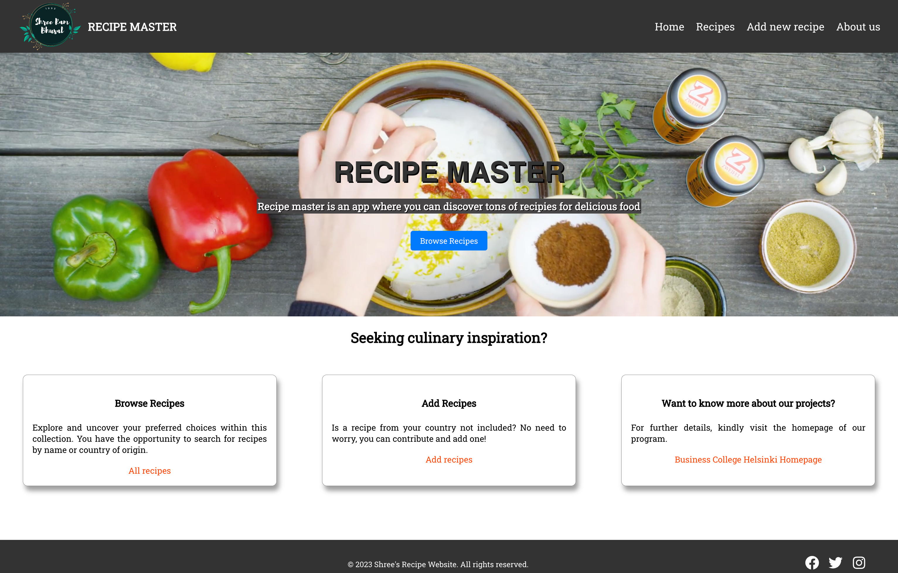
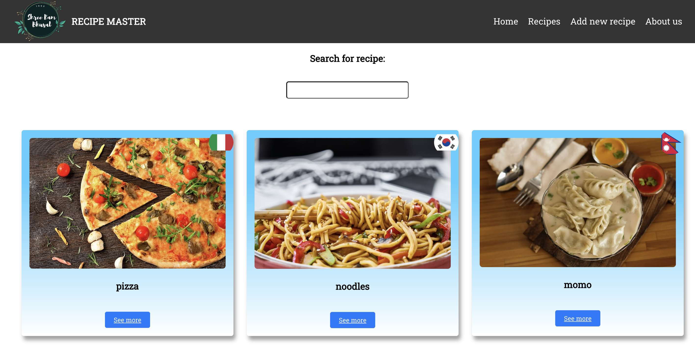
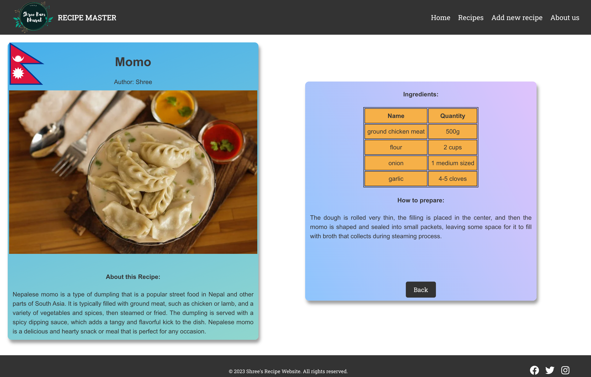
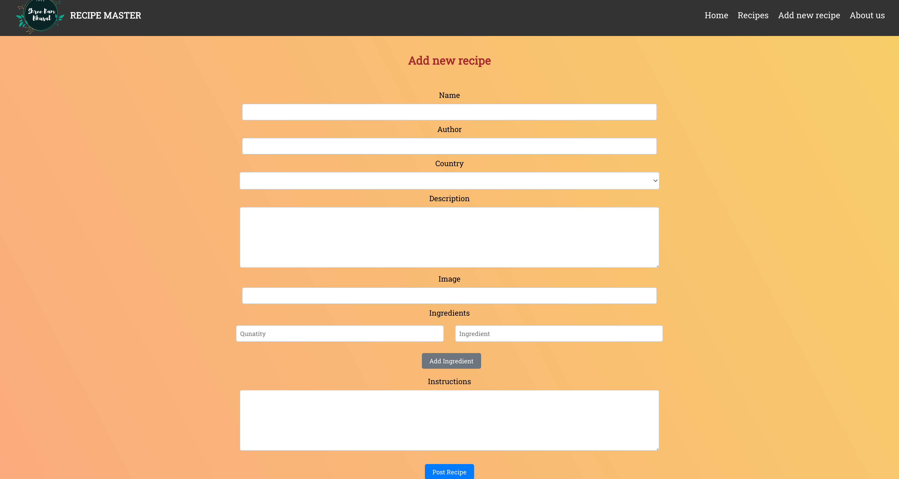
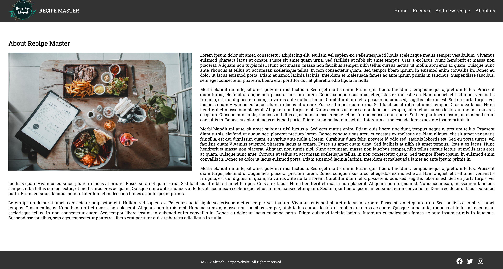

# RECIPE MASTER

This is a final project of the course 'React Basics'. It is an app where the users can explore and uncover different food recipes by name or country of origin. Users can also contribute by adding their own recipes.

## Screenshots
 

  

### App Features

- Function components + hooks
- Separated components (using props)
- Event handlers (onClick, onSubmit)
- Conditional rendering
- Lists and Keys
- Form
- Routing
- GET and POST to JSON-server db.json
- Styling
- Optimized and clean code without errors or warnings

## Technologies used

Built with: 
- Reactjs
- Axios 
- JSON server
- [Countries API](https://restcountries.com/) for flags
- CSS

## Setup and usage
- `npm install` to install all dependencies
- `npm run server` to run JSON server http://localhost:5000/
- `npm start` to run the app (http://localhost:3000/)

## Sources
- Hero banner video from [coverr](https://coverr.co/videos/making-a-sauce-K8kDa3Qe0s)
- Images from [Pexels](https://www.pexels.com/) and [Unsplash](https://unsplash.com/)
- Country flags from [Countries API](https://restcountries.com/)

## Author
- GitHub [@shree0007](https://github.com/shree0007)
